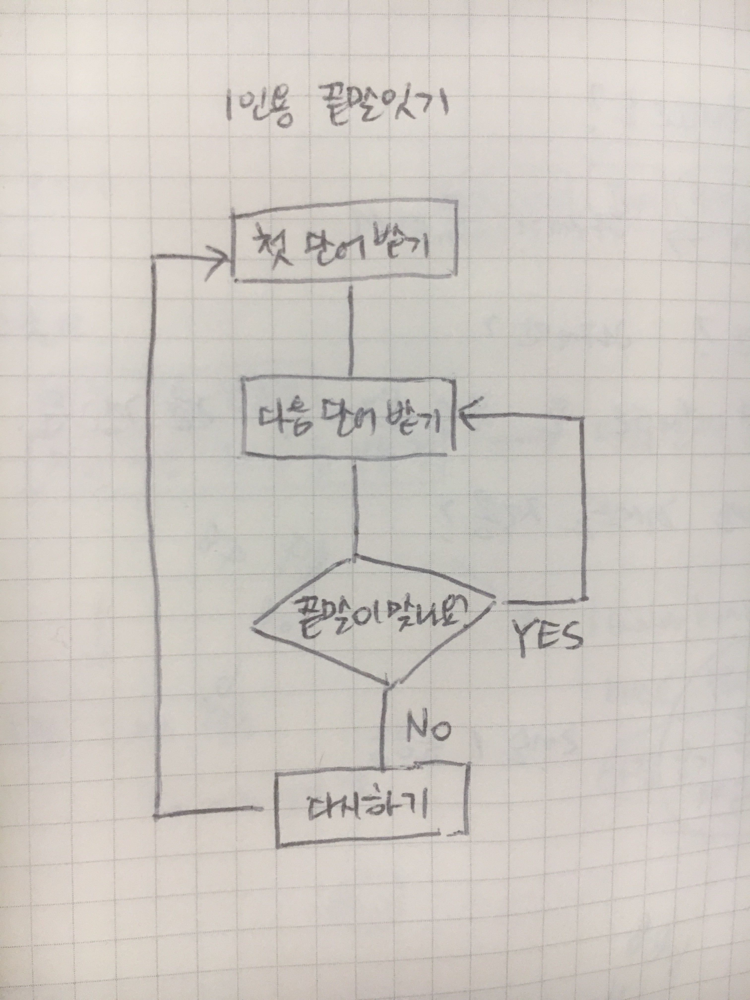

# javascript
## 강의 정보
* [영상 강의 주소](http://edu.goorm.io/learn/lecture/10954/%EC%97%B0%EC%9E%AC-%EC%9B%B9-%EA%B2%8C%EC%9E%84-%EA%B0%9C%EB%B0%9C%EA%B3%BC-%ED%95%A8%EA%BB%98-%EB%B0%B0%EC%9A%B0%EB%8A%94-%EC%9E%90%EB%B0%94%EC%8A%A4%ED%81%AC%EB%A6%BD%ED%8A%B8)
* [유투브 영상 주소](https://www.youtube.com/watch?v=Qq2IJ2iEgWA&list=PLcqDmjxt30Rtbxbh4eJREOVekql_kWVmu)

## 구현 구조도 

## 구현 할 것들 
### 기본 화면 구성 
- [ ] 상단. 끝말잇기 타이틀 
- [ ] 중간 1. 기본적인 사용법 설명 
- [ ] 중간 2. 입력한 단어가 순서대로 표시될 공간 
- [ ] 하단 1. 안내 문구
- [ ] 하단 2. 시작하기 / 입력창 / 다시하기 
- [ ] 하단 3. 정답 여부 표시
### 시작하기 
- [ ] 하단 1. 에 `끝말잇기를 시작합니다.` 안내 문구 
- [ ] 하단 2. 에 `시작하기` 버튼 
- [ ] `시작하기` 버튼을 누르면 `첫 단어 받기` 로 진행
### 첫 단어 받기
- [ ] input 근처에 `시작할 단어를 입력해주세요.` 안내 문구
- [ ] input 에다가 단어를 입력하면 중간 2. 에 표시 
- [ ] 중간 2. 에 표시된 단어 마지막 글자에 하이라이트 
- [ ] input 근처의 안내 문구가 `다음 단어를 입력하세요.` 로 변경 
### 다음 단어 받기 
- [ ] input 에다가 단어를 입력하면 끝말잇기 결과 판단 
### 끝말이 맞나요? 
- [ ] 끝말잇기 정답 체크 
-- [ ] 정답 : 글자 일치 -> 다음 단어 표시 
-- [ ] 정답 : 딩동댕 알려주기 
- [ ] 끝말잇기 오답 체크 
-- [ ] 오답 : 글자 불일치 -> `다시하기` 표시
-- [ ] 오답 : 땡 알려주기 + 배경화면 색상 변경
### 다음 단어 표시
- [ ] 중간 2. 에 첫 단어 아래에 표시 
- [ ] 중간 2. 에 표시된 단어 제일 앞 글자에 하이라이트 
- [ ] 중간 2. 에 표시된 단어 제일 마지막 글자에 하이라이트 
- [ ] `다음 단어 받기` 상태와 동일
### 다시하기 
- [ ] 오답인 경우에 하단 2. 가 `다시하기` 버튼으로 변경 
- [ ] `다시하기` 를 누르면 `시작하기` 상태로 변경 
